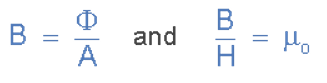
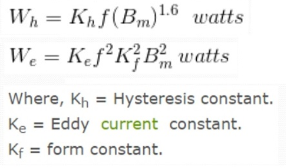

### हिस्टेरेसिस: 
हिस्टेरेसिस एक ग्रीक शब्द पर आधारित है जिसका अर्थ है "पिछड़ना"। इसलिए चुंबकीय हिस्टेरेसिस उस स्थिति को संदर्भित करता है जहां सामग्री के चुंबकीय गुण उस बल से पीछे रह जाते हैं जो उन गुणों को उत्पन्न करता है। हिस्टेरेसिस वक्र हमें सामग्री की चुंबकीय क्षेत्र के प्रति प्रतिक्रिया के बारे में बहुत कुछ बताता है। यदि हम इसे सही ढंग से समझ लें, तो हम सामग्री के चुंबकीय इनपुट के प्रति प्रतिक्रिया को समझ सकते हैं।  

### बीएच-वक्र: 
हिस्टेरेसिस का प्लॉट बी-एच वक्र के रूप में जाना जाता है, जहां बी (सामग्री का फ्लक्स घनत्व, टेस्ला या मेगागॉस में मापा गया) को वर्टिकल अक्ष पर और एच (बाहरी लागू चुंबकीय बल, एम्पीयर प्रति मीटर में मापा गया) को क्षैतिज अक्ष पर प्लॉट किया जाता है।  

### सर्किट डायग्राम:

### हिस्टेरेसिस वक्र की व्याख्या: 
1. हिस्टेरेसिस लूप का आकार और आकार सामग्री के चुंबकीय व्यवहार के बारे में मूल्यवान अंतर्दृष्टि प्रदान करता है।  
2. लूप की चौड़ाई चुंबकीयकरण और विमैग्नेटाइजेशन के प्रत्येक चक्र के दौरान गर्मी के रूप में नष्ट होने वाली ऊर्जा की मात्रा को दर्शाती है। इस ऊर्जा हानि को हिस्टेरेसिस हानि कहा जाता है और यह हिस्टेरेसिस लूप के अंदर के क्षेत्र द्वारा दर्शाई जाती है।  
3. सामग्री की कोर्सिविटी (Hc), जो सामग्री के चुंबकीयकरण को शून्य तक कम करने के लिए आवश्यक चुंबकीय क्षेत्र की ताकत का प्रतिनिधित्व करती है, हिस्टेरेसिस वक्र से निर्धारित की जा सकती है।  
4. इसके अतिरिक्त, सामग्री का रिमनेंस (Br) और संतृप्त चुंबकीयकरण (Bs), जो क्रमशः अवशिष्ट चुंबकीयकरण और लागू क्षेत्र के तहत अधिकतम चुंबकीयकरण का संकेत देता है, हिस्टेरेसिस वक्र से निष्कर्षित किया जा सकता है। 

### गणितीय अभिव्यक्ति: 
फेरोमैग्नेटिक सामग्री में हिस्टेरेसिस हानि (Ph) को निम्न सूत्र का उपयोग करके मापा जा सकता है:
Ph = k * f * Bm * V  
Ph = हिस्टेरेसिस हानि।  
k = सामग्री-विशिष्ट स्थिरांक।  
f = वैकल्पिक चुंबकीय क्षेत्र की आवृत्ति।  
Bm = अधिकतम चुंबकीय फ्लक्स घनत्व।  
α = स्टाइनमेट्ज़ व्युत्क्रमांक।  
V = सामग्री का आयतन।  

हिस्टेरेसिस वक्र और इससे जुड़े मापदंडों को समझने से ट्रांसफॉर्मर, इंडक्टर और चुंबकीय भंडारण प्रणालियों जैसे चुंबकीय घटकों और उपकरणों के डिज़ाइन और अनुकूलन के लिए महत्वपूर्ण जानकारी प्राप्त होती है।
